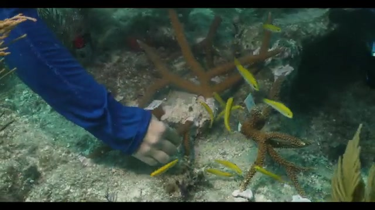
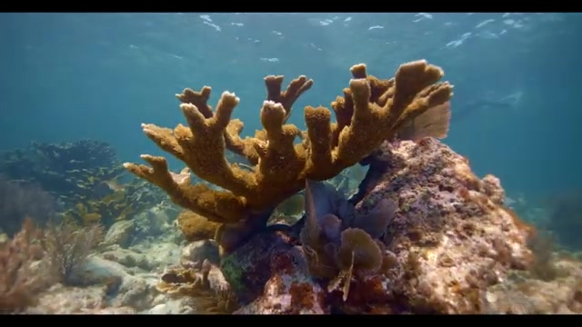
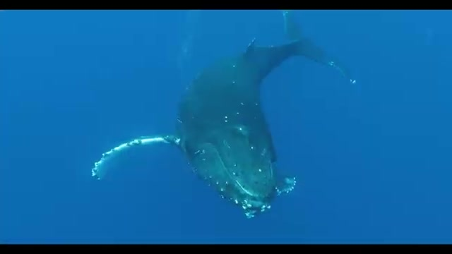
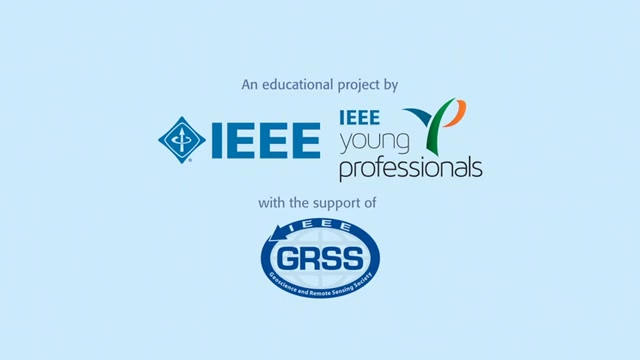
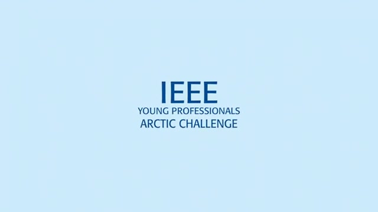
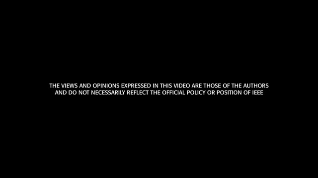
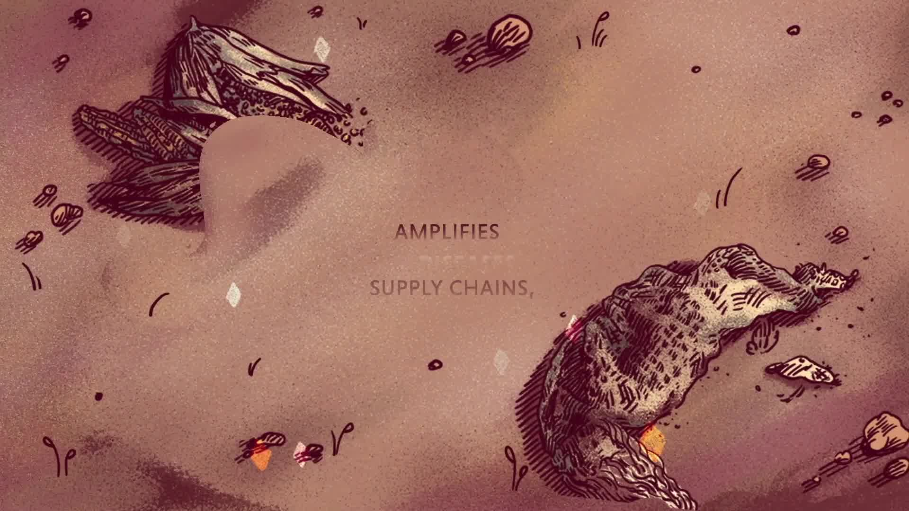
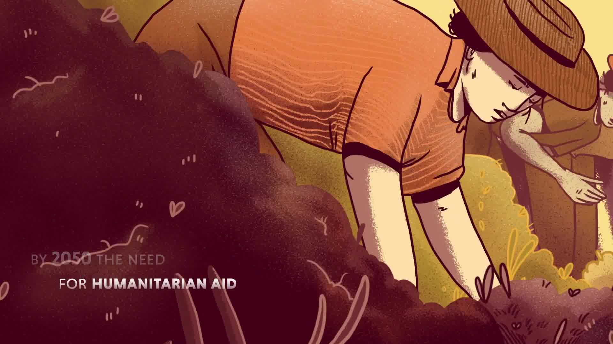
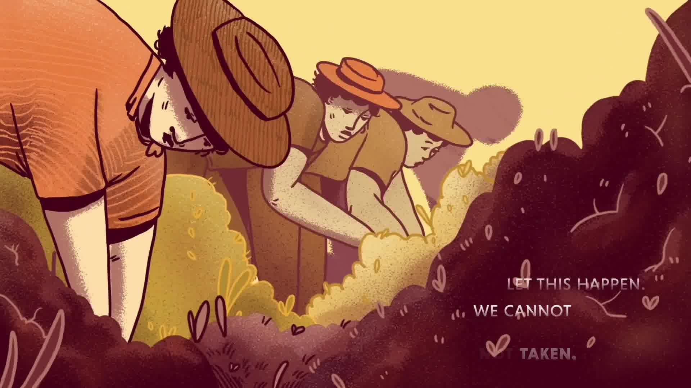

# 🌏 MultiClimate: Multimodal Stance Detection on Climate Change Videos 🌎

<!-- <div align="center" style="text-align: center; white-space: nowrap;">
  <a href="https://www.overleaf.com/7859652375kgfgyhbjnrbw#2d62fc"> 📄Overleaf Paper📄</a> &nbsp; | &nbsp;
  <a href="https://docs.google.com/presentation/d/1WtomzTplkt2kyArtPGuhdFbDmlvHylvLyXN0EbCLU8A/edit#slide=id.p"> 🎥Google Docs Presentation🎥</a> 
</div> -->

## Abstract

<div align="justify">
Climate change (CC) has attracted increasing attention in NLP in recent years. However, detecting the stance on CC in multimodal data is understudied and remains challenging due to a lack of reliable datasets. To improve the understanding of public opinions and communication strategies, this paper presents MultiClimate, the first open-source manually-annotated stance detection dataset with 100 CC-related YouTube videos and 4,209 frame-transcript pairs. We deploy state-of-the-art vision and language models, as well as multimodal models for MultiClimate stance detection. Results show that text-only BERT significantly outperforms image-only ResNet50 and ViT. Combining both modalities achieves state-of-the-art, 0.747/0.749 in accuracy/F1. Our 100M-sized fusion models also beat CLIP and BLIP, as well as the much larger 9B-sized multimodal IDEFICS and text-only Llama3 and Gemma2, indicating that multimodal stance detection remains challenging for large language models.
</div>

## MultiClimate Dataset

<p style="font-size:25px;">Support</p>

<table>
  <tr>
    <td style="width: 40%; vertical-align: top; padding-right: 20px;">
      
    </td>
    <td style="width: 60%; vertical-align: top;">
      <div align="justify">
        <p>
          Together we can address the causes and impacts of climate change to ensure that our spectacular ocean and great lakes continue to thrive while supporting our economies and values.
        </p>
      </div>
    </td>
  </tr>
  <tr>
    <td style="width: 40%; vertical-align: top; padding-right: 20px;">
      
    </td>
    <td style="width: 60%; vertical-align: top;">
      <div align="justify">
        <p>
          Together we can address the causes and impacts of climate change to ensure that our spectacular ocean and great lakes continue to thrive while supporting our economies and values.
        </p>
      </div>
    </td>
  </tr>
  <tr>
    <td style="width: 40%; vertical-align: top; padding-right: 20px;">
      
    </td>
    <td style="width: 60%; vertical-align: top;">
      <div align="justify">
        <p>
          And revealing their wonders for generations to come.
        </p>
      </div>
    </td>
  </tr>
</table>

---

<p style="font-size:25px;">Neutral</p>

<table>
  <tr>
    <td style="width: 40%; vertical-align: top; padding-right: 20px;">
      
    </td>
    <td style="width: 60%; vertical-align: top;">
      <div align="justify">
        <p>
          [Music]
        </p>
      </div>
    </td>
  </tr>
  <tr>
    <td style="width: 40%; vertical-align: top; padding-right: 20px;">
      
    </td>
    <td style="width: 60%; vertical-align: top;">
      <div align="justify">
        <p>
          [Music]
        </p>
      </div>
    </td>
  </tr>
  <tr>
    <td style="width: 40%; vertical-align: top; padding-right: 20px;">
      
    </td>
    <td style="width: 60%; vertical-align: top;">
      <div align="justify">
        <p>
          [Music]
        </p>
      </div>
    </td>
  </tr>
</table>

---

<p style="font-size:25px;">Oppose</p>

<table>
  <tr>
    <td style="width: 40%; vertical-align: top; padding-right: 20px;">
      
    </td>
    <td style="width: 60%; vertical-align: top;">
      <div align="justify">
        <p>
          This double threat of climate change and war pushes people out of their homes, breaks food and supply chains amplifies diseases and weakens health care services.
        </p>
      </div>
    </td>
  </tr>
  <tr>
    <td style="width: 40%; vertical-align: top; padding-right: 20px;">
      
    </td>
    <td style="width: 60%; vertical-align: top;">
      <div align="justify">
        <p>
          By 2050 the need for humanitarian aid is expected to double if urgent steps are not taken.
        </p>
      </div>
    </td>
  </tr>
  <tr>
    <td style="width: 40%; vertical-align: top; padding-right: 20px;">
      
    </td>
    <td style="width: 60%; vertical-align: top;">
      <div align="justify">
        <p>
          We cannot let this happen.
        </p>
      </div>
    </td>
  </tr>
</table>

---

## Overview Workflow
1. Filter videos by CC (Creative Commons) LICENSE
1. Make sure there is the transcript and available in English \
E.g., [The UK's Climate Change Act is a unique law](https://www.youtube.com/watch?v=A5YgMP-JkDo) does not have the transcript because the voice channel is only pure background music. \
E.g., [Climate Change: The Water Paradigm](https://www.youtube.com/watch?v=Q8B4tST8ti8) only provides Vietnamese \
E.g., [The IAEA’s Multifaceted Approach to Climate Change](https://www.youtube.com/watch?v=PB4z-58cj7k) only has French \
E.g., [Which countries are historically responsible for climate change?](https://www.youtube.com/watch?v=6zP0L69ielU) has no sound \
E.g., [Sea Otters that Fight Climate Change](https://www.youtube.com/watch?v=0v1vlolzaus) only background music \
E.g., [Listening to Women: adapting to climate change](https://www.youtube.com/watch?v=ObB0tkqYWqY) mainly in English, but interviewees with other languages so no transcripts in these parts \
E.g., [Forest conservation as a critical buffer](https://www.youtube.com/watch?v=QWElS5ecULA) subtitles disabled \
E.g., [Climate Change](https://www.youtube.com/watch?v=iCiaiv3dsO4) subtitles disabled \
E.g., [The consequences of climate change](https://www.youtube.com/watch?v=Ve-1-4T75ks&t=25s) subtitles disabled \
E.g., [This is Earth in the next 100 years if we don't act on climate change | Ways to Change the World](https://www.youtube.com/watch?v=o-KyEYa3vuM) only background music \
E.g., [Untold stories of climate change loss and damage in the LDCs: Rwanda](https://www.youtube.com/watch?v=VVSWQDDz72I) subtitles disabled \
E.g., [Untold stories of climate change loss and damage in the LDCs: Nepal (Nepali)](https://www.youtube.com/watch?v=zpdExnNQcWg) only in Nepali \
E.g., [Impact of Climate Change on Snow Leopard Habitat](https://www.youtube.com/watch?v=RcjIVe2iT4M) ony background music \
E.g., [A new course for the Congo: Forests, climate change and education](https://www.youtube.com/watch?v=nwZ0nbYy5To) subtitles in French \
E.g., [Combating the effects of climate change in the Caribbean](https://www.youtube.com/watch?v=MutjnGk4aFM) subtitles not in English \
E.g., [Forests Migrate But Not Fast Enough For Climate Change | World Economic Forum](https://www.youtube.com/watch?v=5lDr0rf7S2E) only background music \
E.g., [Protagonists, Together against climate change.](https://www.youtube.com/watch?v=xrN28vBAQgo) subtitles in Spain \
E.g., [Fighting climate change with underwater meadows | UpLink](https://www.youtube.com/watch?v=i1XKClXcM_Y) only background music 


1. Download the video and scripts using `youtube.ipynb` \
**Now also frame extraction in `youtube.ipynb`, first image is also removed, just need to change the URL, id and abbreviation of the video (step 3 to step 4.2 included)**
1. Extract a series of images from a given video [HCCAW.mp4 (03:56)](https://www.youtube.com/watch?v=CGoNpwN0mrs&t=12s)? 
    1. Extract frame every 5 seconds using
    `
    ffmpeg -i CCUIM.mp4 -r 0.2 -start_number 0 CCUIM-%03d.jpg
    `
    1. Remove the first image `-000.jpg`
    1. Add the title of the video as the textual part for the image `-001.jpg` (0 seconds)
1. Replace the `time` to `label` ( 0️⃣:neutral, 1️⃣:support, 2️⃣:oppose): human/machine labeling the ground-truth
1. Evaluate via accuracy, weighted F1 score

### Alternative: Extract scene-changing frames
```
ffmpeg -i HCCAW.mp4 -vf "select='gt(scene,0.4)'" -vsync vfr frame-%2d.jpg
```

## Dataset Statistics

|Set| #          |Videos              | 0️⃣ (16)| 1️⃣ (58)| 2️⃣ (26)|
|---|:----------------:|:-----------------:|:-----------------:|:-----------------:|:-----------------:|
|Train🔵|3,372|Others|1,036|1,449|887
|Dev🟣|417| CCGFS, CCIAP, CICC, EFCC, FIJI, HCCAB, HRDCC, HUSNS, MACC, SAPFS|83|204|130
|Test🔴|420| ACCFP, CCAH, CCSAD, CCUIM, EIB, EWCC, GGCC, SCCC, TICC, WICC|73|194|153
|Total|4,209||1,192|1,847|1,170

## Dataset Overview

- 👍: Videos (animations) selected and annotated by both annotators
- ✅: Check sign that full sentences and relabeling are done

|#| Youtube-ID       |Title              | Link                  |Annotators (IAA) |Label
|--|:----------------:|:-----------------:|:-----------------:|:---------------:|:---------------:|
|👍1|brN2_YNAEK8       |About the Committee on Climate Change| [ACCC](https://www.youtube.com/watch?v=brN2_YNAEK8) | ✅Jiawen, Longfei (0.9152)🔵|1️⃣
|👍2|NTP5a1M2Z6I|Addressing Climate Change through Fiscal Policies in Indonesia| [ACCFP](https://www.youtube.com/watch?v=NTP5a1M2Z6I) | ✅Jiawen, Longfei (0.6978)🔴|1️⃣
|3|t-MiN_0kYhM|Analysing impacts of air quality policies on health and climate change \| Denise Mauzerall| [AIAQ](https://www.youtube.com/watch?v=t-MiN_0kYhM)|✅Jiawen|1️⃣
|4|BQr593iCEn8|AI and digital twins: Tools to tackle climate change| [AIDT](https://www.youtube.com/watch?v=BQr593iCEn8)|✅Jiawen|1️⃣
|5|T4CTgXYI2kA|1-Arctic Methane and Climate Change| [AMCC](https://www.youtube.com/watch?v=T4CTgXYI2kA) | ✅Jiawen|0️⃣
|6|xajNochi7tM|Big data and climate change| [BDCC](https://www.youtube.com/watch?v=xajNochi7tM)|✅Jiawen|0️⃣
|7|eTqKLJ_o9yQ|Bitcoin Energy Consumption & Climate Change: Does Bitcoin Use Too Much Energy? [2021]| [BECCC](https://www.youtube.com/watch?v=eTqKLJ_o9yQ)|✅Jiawen|2️⃣
|8|iKzdIzN4q2Q|Belize: Women in Fisheries Forum 5: Gender and Climate Change - Understanding the Link| [BWFF](https://www.youtube.com/watch?v=iKzdIzN4q2Q)|✅Jiawen|1️⃣
|9|s4ly6o-VT90|Connections between air quality and climate - English - Sept. 2021| [CBAQC](https://www.youtube.com/watch?v=s4ly6o-VT90)|✅Jiawen |2️⃣
|👍10|FGs2QQWFqyQ|The Crucial Connection: Climate Change and Health \| Kaiser Permanente| [CCAH](https://www.youtube.com/watch?v=FGs2QQWFqyQ)|✅Jiawen, Longfei (0.7778)🔴|2️⃣
|11|1tGWJ-NkcGU|Climate change, biodiversity and nutrition - Helping local heroes tell their stories| [CCBN](https://www.youtube.com/watch?v=1tGWJ-NkcGU)|✅Jiawen|1️⃣
|12|lAop3wreUek|Climate change, biodiversity and nutrition nexus| [CCBNN](https://www.youtube.com/watch?v=lAop3wreUek)|✅Jiawen|1️⃣
|13|4VXSrQospVY|Can climate change and biodiversity loss be tackled together? | [CCCBL](https://www.youtube.com/watch?v=4VXSrQospVY)|✅Jiawen|1️⃣
|14|DRXQ9ixPbD8|Combating climate change in the Pacific| [CCCP](https://www.youtube.com/watch?v=DRXQ9ixPbD8)|✅Jiawen|1️⃣
|15|TdxNG8L4JCM|Climate Change and Conflict in Somalia| [CCCS](https://www.youtube.com/watch?v=TdxNG8L4JCM)|✅Longfei|1️⃣
|16|8fbrnAAg7VM|Climate change and development| [CCD](https://www.youtube.com/watch?v=8fbrnAAg7VM)|✅Jiawen|2️⃣
|17|nXOB8YPyc04|Climate Change and Food Supply| [CCFS](https://www.youtube.com/watch?v=nXOB8YPyc04) | ✅Jiawen|2️⃣
|18|MNdF-eVRWX4|Climate Change Fuelling Wilder Weather| [CCFWW](https://www.youtube.com/watch?v=MNdF-eVRWX4)| ✅Jiawen|2️⃣
|19|v24wT16OU2w|Climate Change, Global Food Security, and the U.S. Food System| [CCGFS](https://www.youtube.com/watch?v=v24wT16OU2w)|✅Jiawen🟣|1️⃣
|20|CA8iTY7iMCk|Climate Change and our Health (ADB Insight Full Episode)| [CCH](https://www.youtube.com/watch?v=CA8iTY7iMCk)| ✅Jiawen|1️⃣
|21|mPE7D0wRYoU|Climate Change: Health Equity Stories from The Colorado Trust (English subtitles)| [CCHES](https://www.youtube.com/watch?v=mPE7D0wRYoU)|✅Jiawen|2️⃣
|22|KxBAiad3Xto|Climate change in the Australian Alps| [CCIAA](https://www.youtube.com/watch?v=KxBAiad3Xto)|✅Jiawen|1️⃣
|23|yeih2v4P25A|Climate Change: It’s About Health \| Kaiser Permanente| [CCIAH](https://www.youtube.com/watch?v=yeih2v4P25A)|✅Jiawen|1️⃣
|👍24|m95K7LClIC4|350.org - Climate Change Is About Power| [CCIAP](https://www.youtube.com/watch?v=m95K7LClIC4) | ✅Jiawen, Longfei (0.6716)🟣|1️⃣
|25|b919Fb-P3N8|Climate Change Impacts for Canadian Directors| [CCICD](https://www.youtube.com/watch?v=b919Fb-P3N8) |✅Jiawen|2️⃣
|26|A7ktYbVwr90|Climate change is simple: David Roberts at TEDxTheEvergreenStateCollege|[CCIS](https://www.youtube.com/watch?v=A7ktYbVwr90)| ✅Jiawen|2️⃣|
|27|yVvVk2zNSbo|Untold stories of climate change loss and damage in the LDCs: Sierra Leone| [CCISL](https://www.youtube.com/watch?v=yVvVk2zNSbo)|✅Jiawen|2️⃣
|28|lNBP7aRskVE|Climate Change: Mitigate or Adapt| [CCMA](https://www.youtube.com/watch?v=lNBP7aRskVE)|✅Jiawen|1️⃣
|👍29|5DVa8xBgToc|Climate Change for South African Directors|[CCSAD](https://www.youtube.com/watch?v=5DVa8xBgToc)|✅Jiawen, Longfei (0.4080)🔴|1️⃣
|👍30|GeksVaAnMzc|Climate Change or Social Change: The Role of Blockchain| [CCSC](https://www.youtube.com/watch?v=GeksVaAnMzc)|✅Jiawen, Longfei (0.3244)|1️⃣
|31|zI9h-HTBHO8|Climate Change: Take Action| [CCTA](https://www.youtube.com/watch?v=zI9h-HTBHO8)|✅Jiawen|1️⃣
|32|fN-ZnY61_C8|Climate Change: The Philippines| [CCTP](https://www.youtube.com/watch?v=fN-ZnY61_C8)|✅Jiawen|1️⃣
|👍33|Vve6zge_RsA       |Climate change unlikely to increase malaria burden in West Africa| [CCUIM](https://www.youtube.com/watch?v=Vve6zge_RsA)| ✅Jiawen, Longfei (0.6328)🔴|0️⃣
|34|RZ-N5KwBaVc|Climate Change is Water Change| [CCWC](https://www.youtube.com/watch?v=RZ-N5KwBaVc)|✅Jiawen|1️⃣
|35|MnTm89dSHhA|Climate Change and Water Quality| [CCWQ](https://www.youtube.com/watch?v=MnTm89dSHhA)|✅Jiawen|1️⃣
|36|OL8a1YEhk_o|Honest Government Ad \| Climate Emergency & School Strikes| [CESS](https://www.youtube.com/watch?v=OL8a1YEhk_o)|✅Jiawen|2️⃣
|👍37|b7LiW66cSM4|How should Coronavirus influence the fight against Climate Change?| [CICC](https://www.youtube.com/watch?v=b7LiW66cSM4)|✅Jiawen, Longfei (0.5681)🟣|1️⃣
|38|vD0lx_b8jNM|COP28: Nuclear Science and Technology for Climate Change Adaptation| [COP](https://www.youtube.com/watch?v=vD0lx_b8jNM)|✅Jiawen|1️⃣
|39|MeFbo0z0xi4|Crop production - Climate change affects biosphere \| Earth Hazards \| meriSTEM | [CPCC](https://www.youtube.com/watch?v=MeFbo0z0xi4)|✅Jiawen|1️⃣
|40|FhyUbeDVM3k|Capturing and transforming CO2 to mitigate climate change | [CTCM](https://www.youtube.com/watch?v=FhyUbeDVM3k)|✅Jiawen|1️⃣
|41|Gu5NKLxqTak|Diet and Climate Change: Cooking Up a Storm| [DACC](https://www.youtube.com/watch?v=Gu5NKLxqTak)|✅Jiawen|1️⃣
|42|OfYGx-N_gB0|Deforestation and Climate Change| [DFCC](https://www.youtube.com/watch?v=OfYGx-N_gB0)|✅Jiawen|1️⃣
|43|CG3pN7qQqZI|This Is How Denmark Protects Its Cities Against Climate Change| [DPIC](https://www.youtube.com/watch?v=CG3pN7qQqZI)|✅Jiawen|1️⃣
|44|Ry-ei9Bu8UI|Developing tools for equality in climate change planning in Tanzania| [DTECC](https://www.youtube.com/watch?v=Ry-ei9Bu8UI) |✅Jiawen|1️⃣
|45|M17pm2iPT_c|Effects Of Climate Change In MN Discussed At Seminar| [ECCDS](https://www.youtube.com/watch?v=M17pm2iPT_c)|✅Jiawen|1️⃣
|46|HzL9hUOh_K4|Ecosystems at risk from Climate Change| [EFCC](https://www.youtube.com/watch?v=HzL9hUOh_K4)|✅Jiawen🟣|1️⃣
|👍47|kjTAWBPPez0|Earth Is Blue: Climate Change in your Sanctuaries| [EIB](https://www.youtube.com/watch?v=kjTAWBPPez0)|✅Jiawen, Longfei (0.6474)🔴|1️⃣
|👍48|Qmxg97Ae9Wg|Extreme Weather and Climate Change, EarthNow| [EWCC](https://www.youtube.com/watch?v=Qmxg97Ae9Wg)|✅Jiawen, Longfei (0.6903)🔴|2️⃣
|👍49|Wrb4b28dgcU|Forests and Climate Change| [FCC](https://www.youtube.com/watch?v=Wrb4b28dgcU)|✅Jiawen, Longfei (0.6061)|2️⃣
|50|9DaUn0geq4U|Fiji: Standing tall against climate change threats| [FIJI](https://www.youtube.com/watch?v=9DaUn0geq4U)|✅Jiawen🟣|2️⃣
|👍51|ison6lQozDU|Food loss and waste are among the main causes of climate change| [FLW](https://www.youtube.com/watch?v=ison6lQozDU)|✅Jiawen, Longfei (0.8182)🔵|2️⃣
|52|M9wSP16P9xM|+Forest, together against climate change| [FTACC](https://www.youtube.com/watch?v=M9wSP16P9xM) | ✅Longfei|1️⃣
|👍53|epZ9Rw-i8Mo|Greenland's glaciers and Climate Change, Danish Broadcasting Corporation - Denmark| [GGCC](https://www.youtube.com/watch?v=epZ9Rw-i8Mo)|Jiawen, ✅Longfei (0.7362)🔴|2️⃣
|54|S9Z_h1_LQ0o|How Climate Change Affects Biodiversity| [HCCAB](https://www.youtube.com/watch?v=S9Z_h1_LQ0o) | ✅Longfei🟣|1️⃣
|55|me14ikumMZE|How Climate Change Affects the Ecosystem| [HCCAE](https://www.youtube.com/watch?v=me14ikumMZE) | ✅Longfei|2️⃣
|56|CGoNpwN0mrs       |How Climate Change /Actually/ Works...in 4 Minutes| [HCCAW](https://www.youtube.com/watch?v=CGoNpwN0mrs)|✅Longfei|0️⃣
|57|KTA5onaECFE       |How climate change influences geopolitics – Interview with Francesco Femia| [HCCIG](https://www.youtube.com/watch?v=KTA5onaECFE)|✅Longfei|2️⃣
|58|RFsxDqQWjhk|How COVID-19 is impacting air pollution and climate change| [HCI](https://www.youtube.com/watch?v=RFsxDqQWjhk) | ✅Longfei|1️⃣
|59|ivN1QIvdBUI|How do we change our attitude towards climate change? Christiana Figueres | [HDWC](https://www.youtube.com/watch?v=ivN1QIvdBUI) | ✅Longfei|1️⃣
|60|jDueuwB3Tcs|Human Health, Vector-Borne Diseases, and Climate Change| [HHVBD](https://www.youtube.com/watch?v=jDueuwB3Tcs) | ✅Longfei|0️⃣
|61|e_8upuAySOI|Human Rights Day 2012: Climate Change and Human Rights| [HRDCC](https://www.youtube.com/watch?v=e_8upuAySOI) | ✅Longfei🟣|2️⃣
|62|vsbcasoudtM|How are scientists helping whale-watchers adapt to climate change?| [HSHWA](https://www.youtube.com/watch?v=vsbcasoudtM) | ✅Longfei|0️⃣
|👍63|mc1qAnGGGCE|How Solar Panels Work To Reduce Climate Change| [HSPW](https://www.youtube.com/watch?v=mc1qAnGGGCE) | ✅Jiawen, Longfei (0.9255)🔵|1️⃣
|64|RYsZ0NdHKyc|How the US National Security Policy Incorporates Climate Change – Interview with Alice Hill|[HUSNS](https://www.youtube.com/watch?v=RYsZ0NdHKyc) | ✅Longfei🟣|1️⃣
|65|OSA944ShtmE|IMRF: Statement from IOM’s Migration, Environment, Climate Change, and Risk Reduction Division| [IMRF](https://youtube.com/watch?v=OSA944ShtmE) | ✅Longfei|1️⃣
|66|OKPzj-l7gp0|INCAS: Monitoring for Climate Change| [INCAS](https://www.youtube.com/watch?v=OKPzj-l7gp0) | ✅Longfei|0️⃣
|67|ks7rCR7-mF0|Migration and Climate Change in the Global Compact for Migration| [MACC](https://www.youtube.com/watch?v=ks7rCR7-mF0)| ✅Longfei🟣|1️⃣
|👍68|ko4cUnzoPic|Science Action: What's the unique role of methane in climate change?| [MICC](https://www.youtube.com/watch?v=ko4cUnzoPic)| ✅Jiawen, Longfei (0.3641)|2️⃣
|69|vB3_49ULzf0|NASA's Climate Advisor Discusses Climate Change| [NASA](https://www.youtube.com/watch?v=vB3_49ULzf0) | ✅Longfei|1️⃣
|70|EwHtHsBeRIA|Overview of the C-ROADS Climate Change Policy Simulator| [OCCC](https://www.youtube.com/watch?v=EwHtHsBeRIA) | ✅Longfei|0️⃣
|71|CUdBaExvHy4|President Clinton On the Cost of Climate Change| [PCOCC](https://www.youtube.com/watch?v=CUdBaExvHy4) | ✅Longfei|1️⃣
|72|A6uRlax7AuE|Preserve the Wonder - Climate change action| [PWCCA](https://youtube.com/watch?v=A6uRlax7AuE)| ✅Longfei|1️⃣
|73|yTo3zmn3u84|Removing atmospheric greenhouse gases to prevent dangerous climate change| [RAGG](https://www.youtube.com/watch?v=yTo3zmn3u84)| ✅Longfei|1️⃣
|👍74|_P31w8E_5Zc|Regenerative Agriculture: A Solution to Climate Change| [RASCC](https://www.youtube.com/watch?v=_P31w8E_5Zc)| ✅Jiawen, Longfei (0.6393)|1️⃣
|75|Btqy4-H03dE|Ron Cohen on "BEACO2N" Climate Change Sensors| [RCCCS](https://www.youtube.com/watch?v=Btqy4-H03dE) | ✅Longfei|1️⃣
|76|fCo77PW2G6Y|Reframing climate change science to include indigenous and local knowledge - Dr Tero Mustonen| [RCCS](https://www.youtube.com/watch?v=fCo77PW2G6Y) | ✅Longfei|0️⃣
|77|s3ViLeAG6_U|Richard H Thaler on climate change| [RHTCC](https://www.youtube.com/watch?v=s3ViLeAG6_U) | ✅Longfei|0️⃣
|78|G6JfQwonm78|Rare plant - Snakeshead Fritillary - defies climate change| [RPDCC](https://www.youtube.com/watch?v=G6JfQwonm78) | ✅Longfei|1️⃣
|79|K4dpmfzEASo|Strengthening Africa’s pastoral food systems transformation in the face of climate change| [SAPFS](https://www.youtube.com/watch?v=K4dpmfzEASo)| ✅Longfei🟣|0️⃣
|👍80|N2l_AjZGVQo|System change NOT Climate change: Can we leverage the digital age to get there? - D^2S Agenda| [SCCC](https://www.youtube.com/watch?v=N2l_AjZGVQo) | ✅Jiawen, Longfei (0.7243)🔴|1️⃣
|81|se-BRvZuu7k|Scientists drill deep in Antarctic ice for clues to climate change| [SDDA](https://www.youtube.com/watch?v=se-BRvZuu7k)| ✅Longfei|0️⃣
|82|ZsbSI8UrPYA|Saint Lucia and Climate Change Adaptation (English)| [SLCCA](https://www.youtube.com/watch?v=ZsbSI8UrPYA) | ✅Longfei|1️⃣
|83|id4DZ0NiKk4|Stanford Students Tackle Climate Change| [SSTCC](https://www.youtube.com/watch?v=id4DZ0NiKk4)| ✅Longfei|0️⃣
|84|pCraV8ahpYo|The connections between climate change and mental health| [TCBCC](https://www.youtube.com/watch?v=pCraV8ahpYo) | ✅Longfei|0️⃣
|85|tqavP5lotNo|Transforming our Economy to Combat Climate Change | [TECCC](https://www.youtube.com/watch?v=tqavP5lotNo) | ✅Longfei|1️⃣
|👍86|L555lOp_0pQ|Trade, Investment, and Climate Change in Asia and the Pacific| [TICC](https://www.youtube.com/watch?v=L555lOp_0pQ)|Jiawen, ✅Longfei (0.8719)🔴|1️⃣
|87|xWYwSgvZh38|The inequalities of climate change - ICRC| [TIOCC](https://www.youtube.com/watch?v=xWYwSgvZh38) | ✅Longfei|2️⃣
|88|jsZ2_WFtlDU|Things in Your Home that are Linked to Climate Change| [TIYH](https://www.youtube.com/watch?v=jsZ2_WFtlDU) | ✅Longfei|1️⃣
|89|763lGy43spk|The technology fighting climate change| [TTFCC](https://www.youtube.com/watch?v=763lGy43spk)| ✅Longfei|1️⃣
|90|5KtGg-Lvxso|To understand climate change, understand these three numbers.| [TUCC](https://www.youtube.com/watch?v=5KtGg-Lvxso)| ✅Longfei|0️⃣
|91|SDxmlvGiV9k|UK Climate Change Risk Assessment 2017 - Urgent priorities for the UK| [UKCC](https://www.youtube.com/watch?v=SDxmlvGiV9k)| ✅Longfei|2️⃣
|92|eIcWgCjTHWM|Voices from Vanuatu: Climate Change Impacts and Human Mobility| [VFVCC](https://www.youtube.com/watch?v=eIcWgCjTHWM) | ✅Longfei|2️⃣
|93|ii9mx391VVk|View from the Pacific: ‘Climate change is real’| [VPCC](https://www.youtube.com/watch?v=ii9mx391VVk) | ✅Longfei|1️⃣
|👍94|_IVDYaQDNCg|Wildfires and Climate Change Attribution: It's Complicated!|[WCCA](https://www.youtube.com/watch?v=_IVDYaQDNCg)|Jiawen, ✅Longfei (0.3478)|2️⃣
|95|TM_6C9szLOI       |Why focus on human security when working on climate change adaptation?| [WFHSW](https://www.youtube.com/watch?v=TM_6C9szLOI)|✅Longfei|1️⃣
|👍96|MPiFBW0NnWY|What is Climate Change?| [WICC](https://www.youtube.com/watch?v=MPiFBW0NnWY)|Jiawen, ✅Longfei (0.8381)🔴|2️⃣
|97|mgBYo6eG80U|What is climate change? \| Earth Hazards \| meriSTEM| [WICCE](https://www.youtube.com/watch?v=mgBYo6eG80U)| ✅Longfei|2️⃣
|98|iXvyExAzQ58|What is the Impact of Solar Energy and Solar Panels on Climate Change? | [WISE](https://www.youtube.com/watch?v=iXvyExAzQ58)| ✅Longfei|1️⃣
|99|iFmoMhVb6iw|Cuomo: Walk the Talk on Climate Change| [WTCC](https://www.youtube.com/watch?v=iFmoMhVb6iw) | ✅Longfei|1️⃣
|100|6ObqydfPGLI|Yale Professor Tony Leiserowitz Discusses American Perceptions of Climate Change| [YPTL](https://www.youtube.com/watch?v=6ObqydfPGLI)| ✅Longfei |0️⃣


Note that we use a maximum of 5 characters when naming the link for simplicity. 
If frame-transcript labels in one video are same, we rank 2️⃣ > 1️⃣ > 0️⃣ due to inbalanced data.

## Citation 

Please kindly cite if you find this repository helpful. 

```bibtex
@article{wang2024multiclimate,
  title={MultiClimate: Multimodal Stance Detection on Climate Change Videos},
  author={Wang, Jiawen and Zuo, Longfei and Peng, Siyao and Plank, Barbara},
  journal={arXiv preprint arXiv:2409.18346},
  year={2024}
}
```